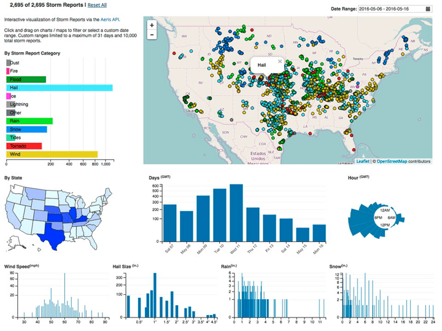

 
  

<h1 align="center"> Block 2. Machine Learning  </h1>
<h3 align="center"> Welcome to my machine learning learning repository!  This repo does not contain any standalone machine learning projects, but is focused on learning. 
  
  This is a collection of my learning journey and projects as I develop skills in machine learning and data science. 

Contents 
This repository contains the following learning resources:

Tutorials: Jupyter notebooks and Python scripts walking through machine learning concepts like regression, classification, clustering, and neural networks. 

Mini Projects: Small example projects to practice specific ML skills and techniques. 

ML Concepts: Notes, summaries, flashcards on machine learning theory and concepts like bias-variance tradeoff, cross-validation and regularization 

Cheat Sheets: Quick reference cheat sheets for ML algorithms, Python data science and libraries. 

Datasets: Small curated open datasets to practice ML modelling. 

Roadmaps: Roadmaps and study plans for gaining ML skills. 

 . </h3>  

 

 
  

<!-- PREREQUISITES -->
<h2 id="prerequisites"> Prerequisites</h2>

  
  

<!--This project is written in Python programming language.  -->
The following open source packages are used in this repo:
* Numpy 
* Pandas 
* Matplotlib 
* Scikit-Learn 
* Seaborn 
* Sklearn 
* SciPy 
* StatsModels 
* Keras 
* TensorFlow 
* PyTorch 
* NLTK 
* SpaCy 

<!-- :paw_prints:-->

<h2 id="Contact"> Contact</h2>

Juan Miguel López Piñero

  

 
            
            
  

