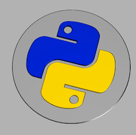
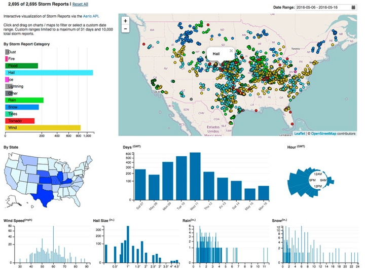

 
  

<h1 align="center"> Block 2. Machine Learning Exercises </h1>
<h3 align="center"> This repo contains the machine learning exercises for the Data Science boot camp . </h3>  

 

 
  

<!-- PREREQUISITES -->
<h2 id="prerequisites"> Prerequisites</h2>

  
  

<!--This project is written in Python programming language.  -->
The following open source packages are used in this course:
* Numpy 
* Pandas 
* Matplotlib 
* Scikit-Learn 
* Seaborn 
* Sklearn

<!-- :paw_prints:-->

<h2 id="Contact"> Contact</h2>

Juan Miguel López Piñero

  

 
            
            
  

